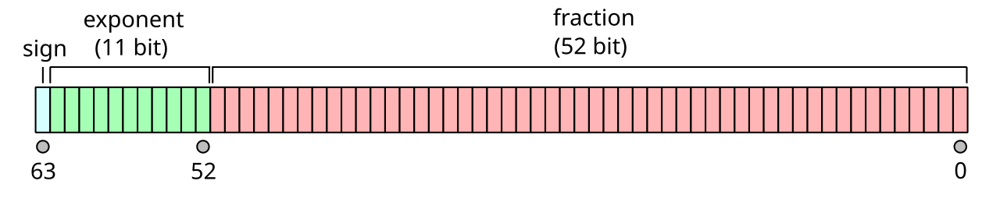

# isNan

## / Overview

IEEE 754で定められたdouble型のNan表現

## / Writeup

まずはプログラム内で使われている特徴的な関数について解説します.

- `char *strstr(const char *string1, const char *string2);`: string1 で string2 が最初に現れるアドレスのポインタを返す.
- `unsigned long long int strtoull(char *string, char **endptr, int base);`: string を base 進数として解釈し，long long int に変換．

これらを用いると，チャレンジの流れを理解することが出来ます．

まず，入力した文字列は

1. 16文字であるか．
2. 各文字が16進数として解釈されるか．
3. 文字列の中に`deadbeef`があるか．

をチェックされます．これらの条件を満たしていれば，`strtoull`関数で64ビットの整数`bits`に変換されます．さらに

```c
memcpy(&value, &bits, sizeof(value));
```

を用いて`bits`は`double`型の変数`value`にコピーされます．最終的に`value`の値が`Nan (Not a number)`であればフラグが取得できます．

### 倍精度浮動小数点数

そもそも`double`型は`IEEE 754`で定められた倍精度浮動小数点数と呼ばれる数の表現方法で，32ビットの倍である64ビットが割り当てられます．更に64ビットは1ビットの符号$`s`$，11ビットの指数部$`e`$，52ビットの仮数部$`f`$に分けられます．



出典：https://ja.wikipedia.org/wiki/%E5%80%8D%E7%B2%BE%E5%BA%A6%E6%B5%AE%E5%8B%95%E5%B0%8F%E6%95%B0%E7%82%B9%E6%95%B0

これら3つの数を用いて

$$(-1)^s \cdot (1.f_{(2)}) \cdot 2^{e-1023}$$

のように数を表現します．例えば円周率は次のように表せます．
```
0 10000000000 1001001000011111101101010100010001000010110100011000 (2)
```
実際に計算すると

$$(-1)^0 \cdot (1.1001001..._{(2)}) \cdot 2^{1024-1023}$$

$$=11.001001..._{(2)}=3.14...$$

となります．さらに特殊な数の表現法も以下のように定義されています．

| 特殊な数 | $`s`$ | $`e`$ | $`f`$ |
| :--- | :---: | :---: | :---: |
| $\pm 0$ | `0 / 1` | `00000000000` | `0000000000000000000000000000000000000000000000000000` |
| $\pm \infty$ | `0 / 1` | `11111111111` | `0000000000000000000000000000000000000000000000000000` |
| Nan | `X` | `11111111111` | `XXXXXXXXXXXXXXXXXXXXXXXXXXXXXXXXXXXXXXXXXXXXXXXXXXXX` ≠0 |

### 解く

ということで`Nan`は指数部を全て1にすれば後は何でも良いということが分かりました．一例として仮数部の最後に`deadbeef`を入れた`Nan`を作ってみます．

```
0 11111111111 0000000000000000000011011110101011011011111011101111
7ff00000deadbeef
```

これは全ての条件を満たしているのでフラグを取得することが出来ます．

