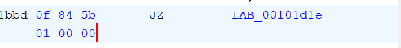

# nazonobasho

## / Overview

`savedata.bin`か`nazonobasho`を改造する。もしくは処理を追う。

## / Writeup

### 解法1

これが一番簡単で`savedata.bin`を書き換えます。`nazonobasho`を実行すると
```
flag_coordinate:   32, 33
player_coordinate: 114, 115
```
と自分の座標が表示されます。この状態でセーブデータを作って`savedata.bin`を見ると、`rs`と表示されています。ascii変換すると`114 115`であり、座標と対応しています。

ということはこのデータを`32 33`である`[s]!`( [s]は空白の意味 )に書き換えて、ゲームを再開することでフラグが表示されます。

### 解法2
ghidra でデコンパイルしたmain関数のフラグ判定ロジックだけ見ます。変数名は見やすいように変更しています。

```c
        printf("flag_coordinate:   %d, %d\n",(ulong)(byte)flag,(ulong)flag._1_1_);
        printf("player_coordinate: %d, %d\n",(ulong)(byte)player,(ulong)player._1_1_);
        if ((byte)player == (byte)flag) {
          if (player._1_1_ == flag._1_1_) {
            print_flag(player,flag);
          }
        }
```

`nazonobasho`ファイルを実行すると
```
flag_coordinate:   32, 33
player_coordinate: 114, 115
```
と表示されることから、`(ulong)(byte)flag`はx座標、`(ulong)flag._1_1_`はy座標であることが分かります。

次に、どうやってフラグを表示しているか見てみましょう。

```c
void print_flag(undefined2 param_1,undefined2 param_2)

{
  undefined1 *puVar1;
  long in_FS_OFFSET;
  undefined1 auStack_d8 [12];
  undefined2 flag;
  undefined2 player;
  int count;
  undefined4 local4;
  undefined8 local3;
  undefined1 *local_b0;
  byte answer [64];
  byte array [72];
  long canary;
  undefined1 *coordinates;
  undefined4 num4;
  
  player = param_1;
  flag = param_2;
  canary = *(long *)(in_FS_OFFSET + 0x28);
  local4 = 4;
  local3 = 3;

  for (puVar1 = auStack_d8; puVar1 != auStack_d8; puVar1 = puVar1 + -0x1000) {
    *(undefined8 *)(puVar1 + -8) = *(undefined8 *)(puVar1 + -8);
  }
  *(undefined8 *)(puVar1 + -8) = *(undefined8 *)(puVar1 + -8);
  // arrayの中身を更新
  array[0] = 0x1c;
  array[1] = 9;
  (2から0x3eを省略)
  array[0x3f] = 0x36;
  // coordinatesの中身は0x20212021
  local_b0 = puVar1 + -0x10;
  puVar1[-0x10] = (undefined1)player;
  local_b0[1] = player._1_1_;
  local_b0[2] = (undefined1)flag;
  local_b0[3] = flag._1_1_;
  coordinates = local_b0;

  num4 = local4;
  *(undefined8 *)(puVar1 + -0x18) = 0x101ee8;
  // ハッシュを計算する
  gen_sha512(coordinates,num4,answer,num4,4,0);
  // answerとarrayをXORする
  for (count = 0; count < 0x40; count = count + 1) {
    answer[count] = answer[count] ^ array[count];
  }

  *(undefined8 *)(puVar1 + -0x18) = 0x101f50;
  // 表示
  printf("flag: %s\n",answer);
  if (canary == *(long *)(in_FS_OFFSET + 0x28)) {
    return;
  }
                    /* WARNING: Subroutine does not return */
  __stack_chk_fail();
}
```

コメントに書いた通り計算しているので、`gen_hash`の処理を見ましょう。

```c
void gen_sha512(void *coordinates,uint num4,uchar *answer)

{
  long in_FS_OFFSET;
  SHA512_CTX shaCTX;
  long canary;
  
  canary = *(long *)(in_FS_OFFSET + 0x28);
  // 初期化
  SHA512_Init(&shaCTX);
  // coordinatesをハッシュ化
  SHA512_Update(&shaCTX,coordinates,(ulong)num4);
  // 
  SHA512_Final(answer,&shaCTX);
  if (canary != *(long *)(in_FS_OFFSET + 0x28)) {
                    /* WARNING: Subroutine does not return */
    __stack_chk_fail();
  }
  return;
}
```

ここで引数の数が違うことに気がつくかもしれません。この様な場合は呼び出される側の`3`つが正しく、呼び出す側の`6`つから最初の3つを当てはめれば大丈夫です。

この処理では`answer`に`coordinates`をSHA512ハッシュしたものが代入されます。

元の`print_flag`関数に戻って、この`answer`と`array`をXORするとフラグが表示されます。

### 解法3

障害物をすり抜けて宝物を取っちゃおう作戦。`main`の中には操作を管理している`move`関数がある。

```c
void move(char param_1,byte *param_2,undefined2 param_3)

{
  char local_c [4];
  
  local_c[0] = param_1;
  switch(param_1) {
  case 'a':
    if (MAP[(long)(int)(uint)*param_2 * 0x80 + (long)(int)(param_2[1] - 1)] != '\x02') {
      param_2[1] = param_2[1] - 1;
    }
    break;
  default:
    break;
  case 'd':
    if (MAP[(long)(int)(uint)*param_2 * 0x80 + (long)(int)(param_2[1] + 1)] != '\x02') {
      param_2[1] = param_2[1] + 1;
    }
    break;
  case 'p':
    print_all_map(*(undefined2 *)param_2,param_3);
    puts("Press any character!");
    __isoc99_scanf(&DAT_00103068,local_c);
    break;
  case 'q':
                    /* WARNING: Subroutine does not return */
    exit(0);
  case 's':
    save_coordinate(*(undefined2 *)param_2);
    break;
  case 'w':
    if (MAP[(long)(int)(*param_2 - 1) * 0x80 + (long)(int)(uint)param_2[1]] != '\x02') {
      *param_2 = *param_2 - 1;
    }
    break;
  case 'x':
    if (MAP[(long)(int)(*param_2 + 1) * 0x80 + (long)(int)(uint)param_2[1]] != '\x02') {
      *param_2 = *param_2 + 1;
    }
  }
  return;
}
```

このMAP配列は
* `00`, `01`: 道
* `02`: 壁
* `03`: 宝物

に対応していて、もし移動先が壁なら更新をしないようになっている。この判定をなくすことで壁をすり抜けます。この処理をアセンブリでみると`0f 84`で始まる`JZ`命令になっています。ここを何もしない`NOP`に書き換えることですり抜けられます。(書き換えはHex Editorなどで)



> 書き換えたファイルを[nazonobasho_ghost](./nazonobasho_ghost)として公開しますが実行は自己責任でお願いします。